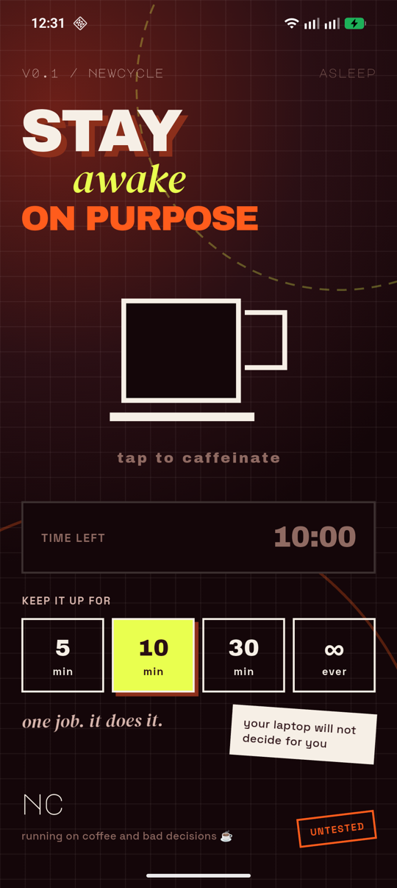
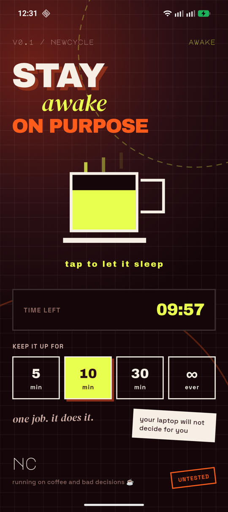

# Caffeinated

Caffeinated is an Android app that keeps your screen on after you switch away or lock the phone, for a set time or indefinitely. No account, no data collection, no network calls.

> **Working name.** "Caffeinated" hasn't been through a naming or trademark check yet, so it may change.

<p>
  
  
</p>

## Why Android only

Staying on after you leave the app needs a real background wake lock. iOS gives third-party apps no equivalent: once an app is backgrounded, the OS suspends it within seconds, and no public API keeps the screen alive from there. A foreground-only iOS build would stop working the moment you switch apps, so there isn't one. The cut list in [`docs/rules.md`](docs/rules.md) has the full reasoning.

## How it works

- A native Android foreground service (`KeepScreenOnService`) holds a `PowerManager` wake lock and shows an ongoing, low-priority notification while active. Android requires that notification for any app keeping the device awake in the background.
- Pick 5, 10 or 30 minutes, or forever, before starting. The notification counts down with Android's native chronometer, and the service schedules its own auto-stop, so the app doesn't need to stay open.
- Reopening the app re-syncs with the service's actual state instead of a remembered guess, because Android can kill the service independently of the app.

## Running it

There's no prebuilt release yet, so you build it from source.

```bash
flutter pub get
flutter run
```

You need the Android SDK and a device or emulator. There is no iOS, web, desktop or Linux target (see "Why Android only").

## Project structure

- `lib/main.dart`: UI and app state.
- `lib/screen_awake_service.dart`: the MethodChannel bridge to native Android. The widget tree never talks to platform channels directly.
- `android/app/src/main/kotlin/.../KeepScreenOnService.kt`: the foreground service, with the wake lock, notification and auto-stop timer.
- `android/app/src/main/kotlin/.../MainActivity.kt`: the MethodChannel handler that connects Dart calls to the service.
- `docs/rules.md`: the design decisions behind the app, including what was left out and why.

## Permissions

| Permission | Why |
|---|---|
| `WAKE_LOCK` | Keeps the screen and CPU on while the service is active. |
| `FOREGROUND_SERVICE` / `FOREGROUND_SERVICE_SPECIAL_USE` | Required to run a foreground service that isn't media, location or another predefined type. "Special use" is the right Android 14+ category here, with a justification declared in the manifest. |
| `POST_NOTIFICATIONS` | Shows the ongoing notification Android requires while the wake lock is held. Without it the wake lock still works, but you won't see the status notification. |

No other permissions, no analytics, no network access.

## License

[MIT](LICENSE)
